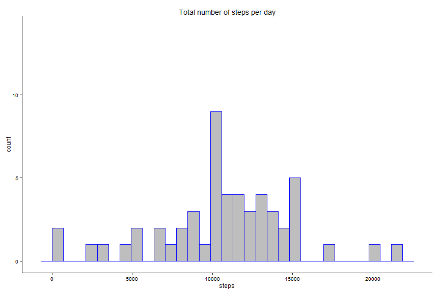
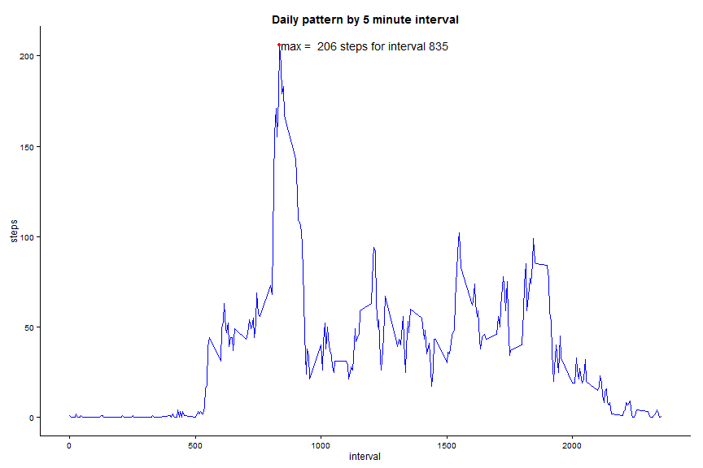

### R settings and packages


### Part 1 - Loading and preprocessing the data

```r
#___1.1___Load the data
setwd("C:/repos_github/coursera/repres/data")
dt_initial <- data.table(read.table("activity.csv", sep = ",", header = TRUE))

#___1.2___Process/transform the data into a format suitable for the analysis
#         For this par of the assignment, only complete cases of the dataset is used
#         In other words, all missing values for all columns are removed.
#         Note, however, that the assigment requires quite a bit more data transforming, 
#         but this will be done at the appropriate parts of the assignment to show the work flow.
dt_initialNoNa <- dt_initial[complete.cases(dt_initial),]

# Rows with missing data removedc
naRemoved <- nrow(dt_initial) - nrow(dt_initialNoNa)
```

### Part 2 - What is the mean total number of steps taken per day?

```r
#___2.1___Calculate the total number of steps taken per day
#         For the total number of steps per day, and the corresponding histogram,
#         it is convenient to transform the data into showing unique dates in the date column.
#         This way, total steps for all time intervals are displayed for each day in
#         the datatable dt_dailysteps.
#         There are several ways you can do this. The package data.table has several methods,
#         but mostly I use and sql package for R called sqldf.

# Number of steps per day using data.table
dt_dailystepsDT <- dt_initialNoNa[,.(steps.sum = sum(steps)),by=date]

# Number of steps per day using sqldf
dt_dailysteps <- sqldf("SELECT sum(steps) as stepsum, date 
        FROM dt_initialNoNa
        Group by date")
remove(dt_dailystepsDT)

#___2.2___Make a histogram of number of steps taken each day
h1 <- ggplot(data=dt_dailysteps, aes(dt_dailysteps$stepsum)) + geom_histogram(colour = "blue", fill = "grey")
h1 <- h1 + theme_classic()
h1 <- h1 + ggtitle("Total number of steps per day") + xlab("steps")
h1 <- h1 + ylim(0, 14)
plot(h1)
```

 

```r
#setwd("C:/repos_github/coursera/repres")
#ggsave(filename = "Histogram Number of Steps.pdf", plot = h1)

#___2.3___Calculate and report the mean and median of the total number of steps taken per day
nsteps <- sum(dt_dailysteps$steps)
avgsteps <- mean(dt_dailysteps$stepsum)
medsteps <- median(dt_dailysteps$stepsum)
```

The average number of steps taken per day, without removing missing values, is 570608. The mean and median for the same category is 10788.19  and 10765.

### Part 3 - What is the average daily pattern?

```r
#___3.1___Make a time series plot  of the 5 minute intervals averaged accross all days.
#         Again, it is convenent to transform the original data.
#         Here, the data is stored as an average for each interval accross all observed days
#         in tha data table dt_dailypattern.

# Data transformation
dt_dailypattern <- sqldf("SELECT interval, avg(steps) as steps 
        FROM dt_initialNoNa
        Group by interval")

# The next step adds an index to dt_dailypattern for charting purposes.
# Using the time intervals on a continuos x-axis results in an uneven
# time series due to the jumps between, for example, 955 and 1000.
# Using an index gives a smoother line, but it would also be convenient to change the x-axis notation.
# I'm doing both.

idx1 <- 1:nrow(dt_dailypattern)
dt_dailypattern <- data.table(dt_dailypattern, idx1)

# The plot, step 1
p1 <- ggplot(dt_dailypattern, aes((interval), steps)) + geom_line(colour = "blue") + theme_classic() + 
      ggtitle("Daily pattern by 5 minute interval") + xlab("interval")

#___3.2___Which 5-minute interval, on average across all the days in the dataset, contains the maximum number of steps?

# Find interval with max steps
maxsteps = max(dt_dailypattern$steps)

# Look up the corresponding interval for the max number of steps
maxint <- sqldf("SELECT interval, max(steps)
        FROM dt_dailypattern")

dailymax <- maxint[1,2]

# The plot step 2 - Add a point in the plot indicating the interval with max number of steps and plot it.
p1 <- p1 + geom_point(data = subset(dt_dailypattern, interval == maxint$interval[1]),
                      colour = "red")
p1 <- p1 + geom_text(data = subset(dt_dailypattern, interval == maxint$interval[1]),
                      aes(x = interval,y = steps, hjust = -0.01
                          , label = paste("max = ",dailymax, "steps for interval", maxint[1,1])))
# Plot the plot
p1 <- p1 + theme(plot.title = element_text(lineheight=.8, face="bold"))
p1
```

 

The interval which contains the maximum average steps per day, is 835.

### Part 4 - Imputing Missing values

```r
# OBJECTIVE:  Replace missing step data for all intervals with
#             average number of stepds per day for those observations
#             without missing values.
#             Missing observations, if any, for date and interval are removed.

#___4.1___Calculate and report the total number of missing values in the dataset 
# A look at the data
summary(dt_initial)
```

```
##      steps                date          interval     
##  Min.   :  0.00   2012-10-01:  288   Min.   :   0.0  
##  1st Qu.:  0.00   2012-10-02:  288   1st Qu.: 588.8  
##  Median :  0.00   2012-10-03:  288   Median :1177.5  
##  Mean   : 37.38   2012-10-04:  288   Mean   :1177.5  
##  3rd Qu.: 12.00   2012-10-05:  288   3rd Qu.:1766.2  
##  Max.   :806.00   2012-10-06:  288   Max.   :2355.0  
##  NA's   :2304     (Other)   :15840
```

```r
# Total number of missing values
missingTotal <- sum(sapply(dt_initial, function(x) sum(is.na(x))))


#___4.2___Devise a strategy for filling in all of the missing values in the dataset
#         There are a total of 2304 missing values in the original dataset, 
#         all of which are missing observations for steps for given dates and intervals.
#         The missing values will be replaced by the average number of steps for the according interval

#___4.3___Create a new dataset that is equal to the original dataset but with the missing data filled in.
#         There are surely many ways to do this, perhaps most efficiently in dplyr.
#         I'm going to brute force the whole process using a nested For Loop.
#         The following code loops through the table dt_imputed.
#         For each missing value, the code loops through the table dt_avgsteps, finds
#         the corresponding step count, and writes it to the table dt_imputed.

# Make a data table in which missing values will be raplaced.
dt_imputed <- dt_initial

# Make a data table that contains daily averages for all intervals
dt_avgsteps <- data.table(sqldf("SELECT interval, avg(steps) as steps 
        FROM dt_initialNoNa
        Group by interval"))

# Brute Force For Loop, replacing NAs in dt_imputed with an average step count.
i <- 1
j <- 1
nmiss <- 0
fakesteps <- 0
for(i in 1:length(dt_initial$steps)) {
  #print(dt_avgsteps$steps[i])
  if (is.na(dt_initial$steps[i])) {
        #print(paste(i, "missing", sep = " - "))
        nmiss <- nmiss + 1
        for(j in 1:length(dt_avgsteps$steps)) {
          #print(paste(nmiss,j, "missing", sep = " - "))
          
          if (dt_initial$interval[i] == dt_avgsteps$interval[j]) {
              # print(paste(i,j, "missing", sep = " - "))
              dt_imputed$steps[i] <- dt_avgsteps$steps[j]
              fakesteps <- fakesteps + dt_avgsteps$steps[j]
              break
          }
        }
  }
}
#i
# nmiss
# themissing <- nrow(subset(dx1, is.na(dt_nonmissing$steps)))
# themissing
# fakesteps
# missmix <- data.table(dt_missing, dt_nonmissing$steps)
# Look at the data
head(dt_imputed)
```

```
##    steps       date interval
## 1:     1 2012-10-01        0
## 2:     0 2012-10-01        5
## 3:     0 2012-10-01       10
## 4:     0 2012-10-01       15
## 5:     0 2012-10-01       20
## 6:     2 2012-10-01       25
```

```r
setwd("C:/repos_github/coursera/repres/data")
write.table(dt_imputed, "imputedData.csv", row.names = FALSE)
#remove(nonmissing)
#nonmissing <- data.table(read.table("imputedData.csv", sep = " ", header = TRUE))

#___4.4___Make a histogram of the total number of steps taken each day 
#         and Calculate and report the mean and median total number of steps taken per day

# Order sum of steps per day for all intervals
dt_dailysteps2 <- data.table(sqldf("SELECT sum(steps) as stepsum, date 
        FROM dt_imputed
        Group by date"))

# Look at the data
head(dt_dailysteps)
```

```
##   stepsum       date
## 1     126 2012-10-02
## 2   11352 2012-10-03
## 3   12116 2012-10-04
## 4   13294 2012-10-05
## 5   15420 2012-10-06
## 6   11015 2012-10-07
```

```r
head(dt_dailysteps2)
```

```
##    stepsum       date
## 1:   10641 2012-10-01
## 2:     126 2012-10-02
## 3:   11352 2012-10-03
## 4:   12116 2012-10-04
## 5:   13294 2012-10-05
## 6:   15420 2012-10-06
```

```r
# Number of steps per day, calculations
nstepsNoNa <- sum(dt_dailysteps2$steps)
avgsteNoNa <- mean(dt_dailysteps2$steps)
medstepsNoNa <- median(dt_dailysteps2$steps)

# Histogram of number of steps per day
h2 <- ggplot(data=dt_dailysteps2, aes(dt_dailysteps2$steps)) + geom_histogram(colour = "blue", fill = "grey")
h2 <- h2 + theme_classic()
h2 <- h2 + ggtitle("Total number of steps per day") + xlab("steps")
h2 <- h2 + ylim(0, 14)
#plot(h2)
setwd("C:/repos_github/coursera/repres")
ggsave(filename = "Histogram Number of Steps no missing values.pdf", plot = h1)
```

 

There are a total of 2304 missing values in the original dataset, all of which are missing observations for steps for given dates and intervals.

The sum of steps added to the original dataset is 85128.
Below is a histogram showing the distribution of steps after missing values have been imputed.

```r
plot(h2)
```

 


### Final touch

```r
#___1.0___  Make md file
library(knitr)
knit('PA1_template.Rmd')
```

```
## Error in parse_block(g, patterns): duplicate label 'Settingz'
```
