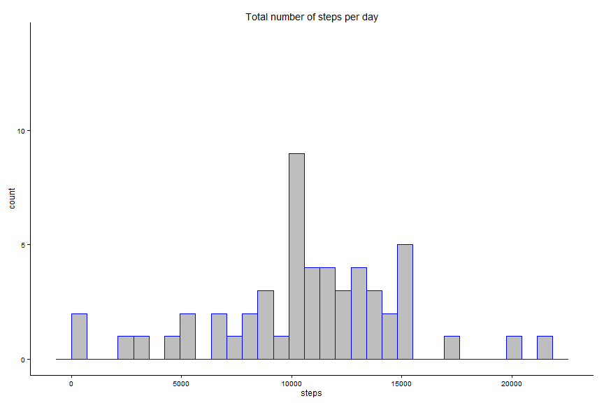
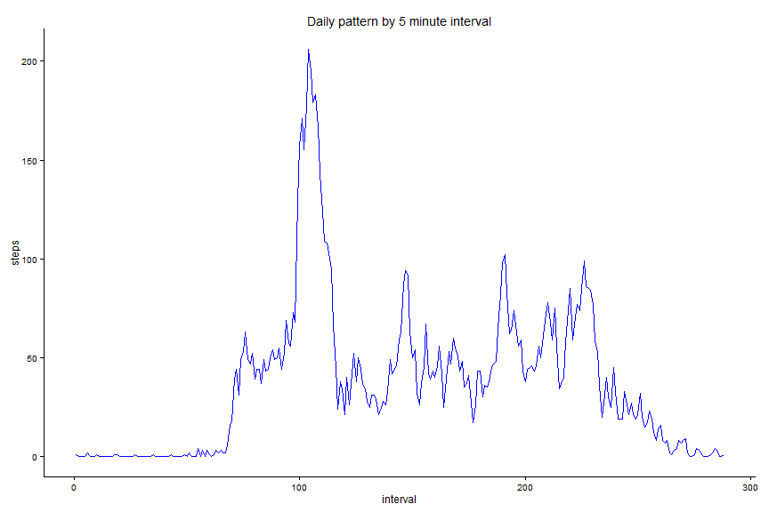
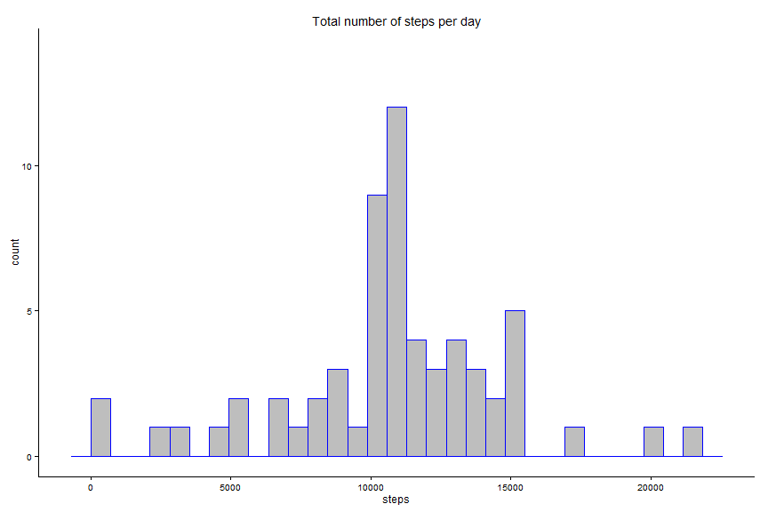
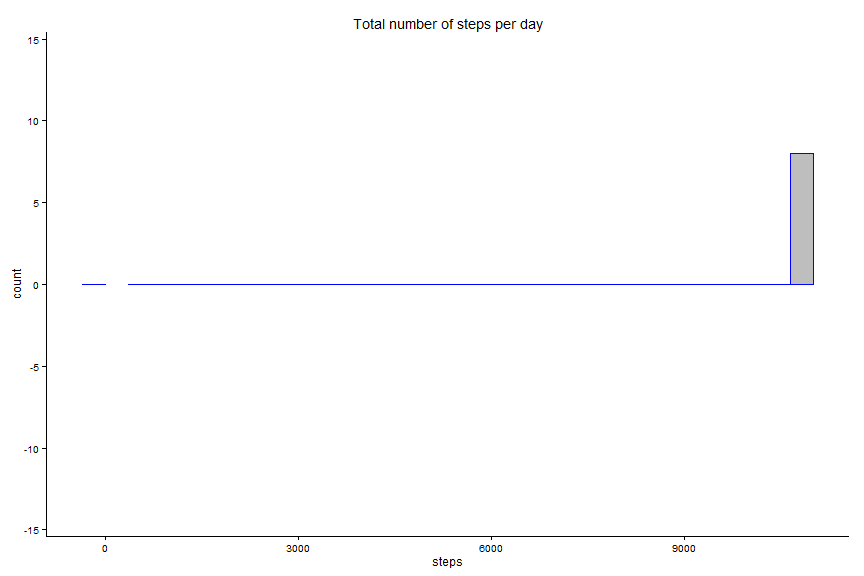

### Getting the data

```r
# Load the data
setwd("C:/repos_github/coursera/repres/data")
dt1 <- read.table("activity.csv", sep = ",", header = TRUE)
dt1 <- data.table(dt1)
#names(dt1)
#length(names(dt1))

# Remove missing values
dt2 <- dt1[complete.cases(dt1),]

# Rows with missing data removed
naRemoved <- nrow(dt1) - nrow(dt2)
dt1 <- dt2
remove(dt2)
```

### Analysis part 1 - Histogram

```r
# Number of steps per day, data.table
dt2 <- dt1[,.(steps.sum = sum(steps)),by=date]

# Number of steps per day, sqldf
dt2s <- sqldf("SELECT sum(steps), date 
        FROM dt1
        Group by date")

#names(dt2)

# Number of steps per day, calculations
nsteps <- sum(dt2$steps)
avgsteps <- mean(dt2$steps.sum)
medsteps <- median(dt2$steps.sum)


# Histogram of number of steps per day
h1 <- ggplot(data=dt2, aes(dt2$steps.sum)) + geom_histogram(colour = "blue", fill = "grey")
h1 <- h1 + theme_classic()
h1 <- h1 + ggtitle("Total number of steps per day") + xlab("steps")
h1 <- h1 + ylim(0, 14)
plot(h1)
```

 

```r
setwd("C:/repos_github/coursera/repres")
#ggsave(filename = "Histogram Number of Steps.pdf", plot = h1)
```

The average number of steps taken per day, without removing missing values, is 570608. The mean and median for the same category is 10788.19  and 10765.


### Analysis part 2 - Daily pattern

```r
#   1   Average number of steps taken, averaged across all days
#   1.1 Data
dt3 <- sqldf("SELECT interval, avg(steps) as steps 
        FROM dt1
        Group by interval")

idx1 <- 1:nrow(dt3)
dt4 <- data.table(dt3, idx1)

#   1.2 Plot
p1 <- ggplot(dt4, aes((interval), steps)) + geom_line(colour = "blue") + theme_classic() + 
      ggtitle("Daily pattern by 5 minute interval") + xlab("interval")
#p1

p2 <- ggplot(dt4, aes((idx1), steps)) + geom_line(colour = "blue") + theme_classic() + 
      ggtitle("Daily pattern by 5 minute interval") + xlab("interval")
p2
```

 

```r
#   2   Which 5 minute interval has the max number of steps?
maxsteps = max(dt4$steps)
maxint <- sqldf("SELECT interval, max(steps)
        FROM dt4")
maxint$interval[1]
```

```
## [1] 835
```

```r
#ggsave(filename = "Daily pattern.pdf", plot = p1)
```

The interval which contains the maximum average steps per day, is 835.


### Analysis part 3 - Missing values

```r
# OBJECTIVE:  Replace missing step data for all intervals with
#             average number of stepds per day for those observations
#             without missing values.
#             Missing observations, if any, for date and interval are removed.

#   1     Get the data
setwd("C:/repos_github/coursera/repres/data")
dx1 <- read.table("activity.csv", sep = ",", header = TRUE)
dx1 <- data.table(dx1)

#   1.2   Handle missing observations for date and interval
allRows <- nrow(dx1)
missingDates <- nrow(subset(dx1, !is.na(dx1$date)))
missingInterval <- nrow(subset(dx1, !is.na(dx1$interval)))

#___2___Handle missing observations for steps
missingSteps <- nrow(subset(dx1, !is.na(dx1$steps)))

#___2.1____Find average steps per day for each interval
dx3 <- subset(dx1, !is.na(dx1$steps))
dt_avgsteps <- data.table(sqldf("SELECT interval, avg(steps) as steps 
        FROM dt1
        Group by interval"))

#___2.2___Replace missing values in dx4 with values in dt_avgsteps
dt_missing <- dx1

i <- 1
j <- 1
nmiss <- 0

themissing <- nrow(subset(dx1, is.na(dx1$steps)))
dt_nonmissing <- dt_missing
themissing <- nrow(subset(dx1, is.na(dt_nonmissing$steps)))
themissing
```

```
## [1] 2304
```

```r
fakesteps <- 0
for(i in 1:length(dt_missing$steps)) {
  #print(dt_avgsteps$steps[i])
  if (is.na(dt_missing$steps[i])) {
        #print(paste(i, "missing", sep = " - "))
        nmiss <- nmiss + 1
        for(j in 1:length(dt_avgsteps$steps)) {
          #print(paste(nmiss,j, "missing", sep = " - "))
          
          if (dt_missing$interval[i] == dt_avgsteps$interval[j]) {
              # print(paste(i,j, "missing", sep = " - "))
              dt_nonmissing$steps[i] <- dt_avgsteps$steps[j]
              fakesteps <- fakesteps + dt_avgsteps$steps[j]
              break
          }
        }
  }
}
i
```

```
## [1] 17568
```

```r
nmiss
```

```
## [1] 2304
```

```r
themissing <- nrow(subset(dx1, is.na(dt_nonmissing$steps)))
themissing
```

```
## [1] 0
```

```r
fakesteps
```

```
## [1] 85128
```

```r
missmix <- data.table(dt_missing, dt_nonmissing$steps)

#___2.3___Store the results
setwd("C:/repos_github/coursera/repres/data")
write.table(dt_nonmissing, "imputedData.csv", row.names = FALSE)
#remove(nonmissing)
#nonmissing <- data.table(read.table("imputedData.csv", sep = " ", header = TRUE))
```

A total of 2304 missing observations for steps in the original dataset have been replaced with the average number of steps for the corresponding category. The sum of steps added to the original dataset is 85128.
Below is a histogram showing the distribution of steps after missing values have been imputed.

### Analysis part 4 - New histogram after accounting for missing values

```r
#   1     The data

dt5 <- data.table(sqldf("SELECT sum(steps) as steps, date 
        FROM dt_nonmissing
        Group by date"))

# Number of steps per day, calculations
nsteps_dt5 <- sum(dt5$steps)
avgsteps_dt5 <- mean(dt5$steps)
medsteps_dt5 <- median(dt5$steps)


# Histogram of number of steps per day
h1 <- ggplot(data=dt5, aes(dt5$steps)) + geom_histogram(colour = "blue", fill = "grey")
h1 <- h1 + theme_classic()
h1 <- h1 + ggtitle("Total number of steps per day") + xlab("steps")
h1 <- h1 + ylim(0, 14)
plot(h1)
```

 

```r
setwd("C:/repos_github/coursera/repres")
ggsave(filename = "Histogram Number of Steps no missing values.pdf", plot = h1)
```

 

### Final touch

```r
#___1.0___  Make md file
knit('repres_assignment1.Rmd')
```

```
## Error in parse_block(g, patterns): duplicate label 'Settings'
```
